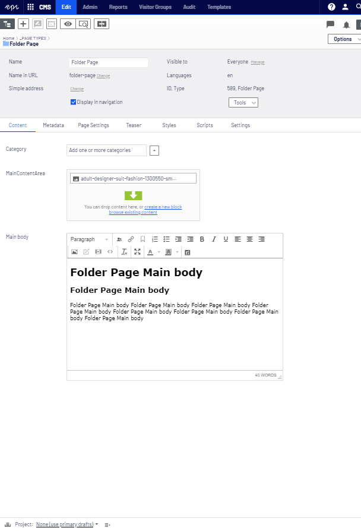

# Folder Page

## Description
A non-visual *Page Type* designed for organization of *Page* content within the page tree.

## Property List
The following property list includes properties that are unique to this content type. For a list of global properties, view our [*Page Global Properties*](#) list as well as the System [*Global Page Properties*](#) list.

*Due to the structural nature of this content, it currently does not contain any page-specific fields.*

*Though this content contains inherited site-wide properties, it contains no view to display these properties visually for the site visitor.*

*It is recommended that Folder Page or other similar structure-only types be used sparingly in order to avoid having URL paths which render no content. E.g. https://mysite.com/{folder-page-path}/*

## Technical Information

## Preview
